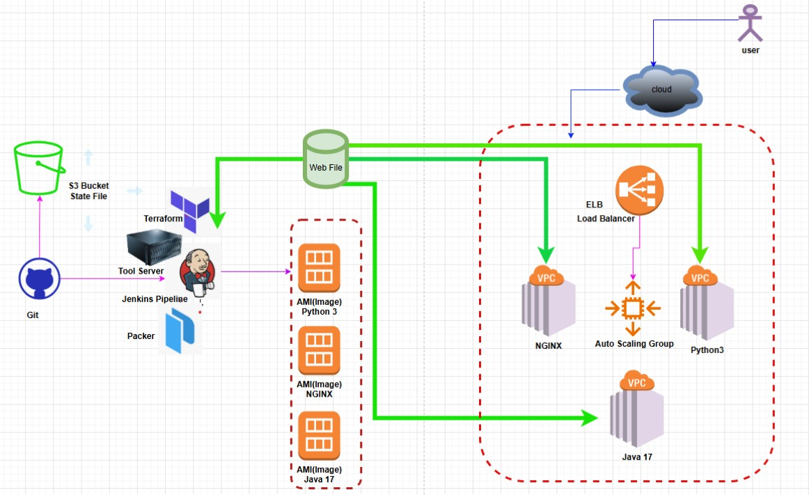
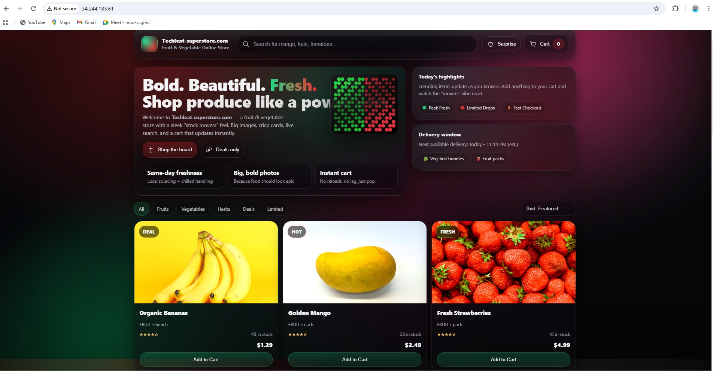
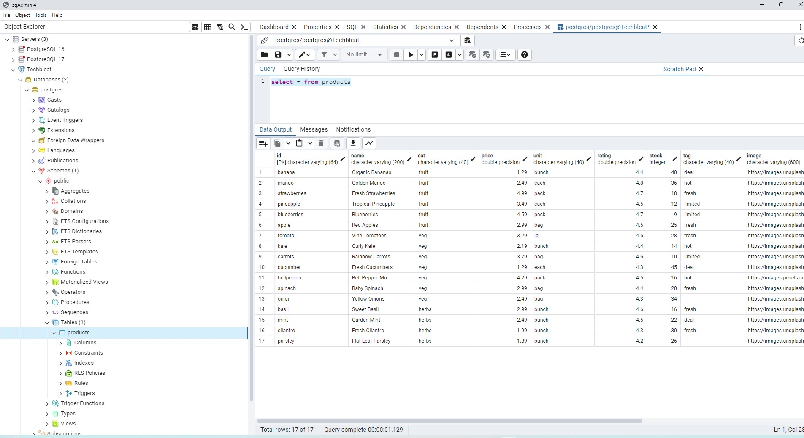

# Deploying a Full-Stack Online Store (Techleat Superstore)

Fork the GitHub https://github.com/techbleat/fruits-veg_market/tree/mini-project
A simple app to show how a 3 Tier app works. A list of **fruits** 

-**HTLM + JS** frontend (Tier 1) - fetches data
-**FastAPI/Python** - backend (Tier 3) provides `/fruits`
-**Database** -  PostgreSQL PaaS backend

## Note

- The frontend points to python backend on `localhost:8000`. You might neet to update this

## Frontend Requirement
- install Nginx/HTTPD and deploy index.html file as required
- install git to download repo

## Backend Python Requirements
- Install git to download repo
- ensure you have python 3 on the server
- `python3 -m venv venv`  Setup required scripts 
- Activate the Virtual environment `source venv\bin/activate`
- install libraries `python -m pip install - r requirements.txt`
- run app `uvivorn main:app --port 8000 --reload` 

## A 3-Tier Architecture Project

- HTML + JS frontend (Tier 1) - fetches data
- FastAPI - backend (Tier 2) API layer
- Postgres DB - storage (Tier 3) proides